<style>
/* Sombra a todo el texto de la presentación */
h1, h2, h3, h4, h5, h6, p, li, td, th, div, span {
  text-shadow: 2px 2px 4px rgba(0, 0, 0, 0.7);
}

/* Forzar color blanco en layouts especiales */
.slidev-layout.cover h1,
.slidev-layout.cover h2,
.slidev-layout.cover p,
.slidev-layout.section h1,
.slidev-layout.section h2,
.slidev-layout.section-2 h1,
.slidev-layout.section-2 h2,
.slidev-layout.section-3 h1,
.slidev-layout.section-3 h2,
.slidev-layout.quote h1,
.slidev-layout.quote p {
  color: white !important;
}
</style>

# Componentes y Estructura de Bases de Datos

## Juliano Cardona 32.281.199.

Fundamentos de Organización y Clasificación

---
layout: section
---

# Parte 1
## Componentes de una Base de Datos

---
layout: default
---

# Componentes Principales

<v-clicks>

- **Campo** 📝
- **Entidad** 📦
- **Estructura de Almacenamiento** 🗄️

</v-clicks>

---
layout: default
---

# Campo

<div grid grid-cols-2 gap-8>

<div>

<v-clicks>

Es la **unidad mínima de información** en una base de datos.

Representa un **atributo** o característica específica.

Cada campo tiene un **nombre** y un **tipo de dato**.

</v-clicks>

</div>

<v-click>

<div bg-gray-100 dark:bg-gray-800 p-4 rounded-lg>

| Campo | Valor |
|-------|-------|
| Nombre | Juan |
| Edad | 25 |
| Email | juan@email.com |
| Teléfono | 555-1234 |

</div>

</v-click>

</div>

---
layout: default
---

# Tipos de Campos

<v-clicks>

| Tipo | Descripción | Ejemplo |
|------|-------------|---------|
| **Numérico** | Almacena números | Edad, Precio, Cantidad |
| **Alfanumérico** | Texto y números | Nombre, Dirección |
| **Fecha** | Fechas y horas | Fecha_Nacimiento |
| **Lógico** | Verdadero/Falso | Activo, Disponible |
| **Memo** | Texto extenso | Descripción, Comentarios |

</v-clicks>

---
layout: default
---

# Entidad

<div grid grid-cols-2 gap-8>

<div>

<v-clicks>

Es un **objeto del mundo real** representado en la base de datos.

Conjunto de **campos relacionados** que describen algo.

También conocida como **Tabla** o **Registro**.

</v-clicks>

</div>

<v-click>

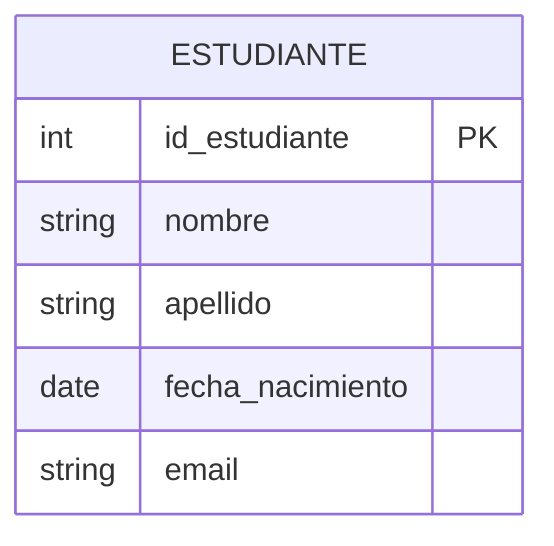

</v-click>

</div>

---
layout: default
---

# Ejemplo de Entidad: ESTUDIANTE

<v-click>

<div text-sm>

| id_estudiante | nombre | apellido | fecha_nacimiento | email |
|:-------------:|:------:|:--------:|:----------------:|:-----:|
| 001 | Juan | Pérez | 1999-05-15 | juan@mail.com |
| 002 | María | García | 2000-03-22 | maria@mail.com |
| 003 | Carlos | López | 1998-11-08 | carlos@mail.com |

</div>

</v-click>

<div mt-6>

<v-clicks>

- Cada [**fila**]{.text-emerald-600 .dark:text-emerald-400} = Un registro (instancia de la entidad)
- Cada [**columna**]{.text-amber-600 .dark:text-amber-400} = Un campo (atributo)
- La [**tabla completa**]{.text-violet-600 .dark:text-violet-400} = La entidad

</v-clicks>

</div>

---
layout: default
---

# Estructura de Almacenamiento

<div grid grid-cols-2 gap-8 items-center>

<div>

<v-clicks>

Es la **forma en que se organizan** y guardan los datos físicamente.

Define **cómo se accede** y **recupera** la información.

Determina la **eficiencia** del sistema.

</v-clicks>

</div>

<v-click>

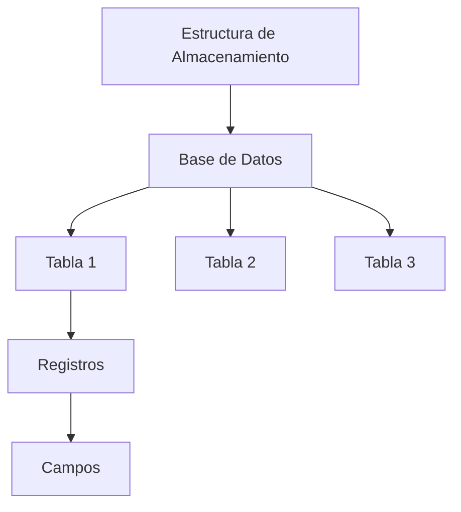

</v-click>

</div>

---
layout: section
---

# Parte 2
## Estructura Física y Lógica

---
layout: default
---

# Dos Perspectivas de los Datos

<div grid grid-cols-2 gap-8>

<v-click>

<div bg-gray-100 dark:bg-gray-800 p-6 rounded-lg>

## 💾 Estructura Física

- **Cómo se almacenan** los datos
- Ubicación en disco duro
- Archivos y bloques
- Índices físicos
- Optimización de espacio

</div>

</v-click>

<v-click>

<div bg-gray-100 dark:bg-gray-800 p-6 rounded-lg>

## 🧠 Estructura Lógica

- **Cómo se visualizan** los datos
- Tablas y relaciones
- Consultas y vistas
- Esquemas conceptuales
- Independiente del hardware

</div>

</v-click>

</div>

---
layout: center
---

# Comparación Visual

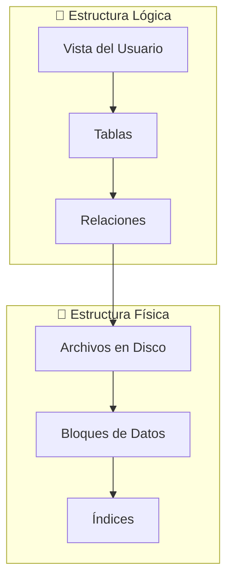

---
layout: section-2
---

# Operaciones sobre Entidades
## Incluir, Actualizar, Eliminar

---
layout: default
---

# INCLUIR (INSERT)

Agregar **nuevos registros** a la base de datos.

<div grid grid-cols-2 gap-6 mt-4>

<v-click>

<div>

### 💾 Entidad Física

<div bg-gray-100 dark:bg-gray-800 p-3 rounded text-sm>

```sql
-- Se escribe en el disco
-- Ocupa espacio real
-- Actualiza índices físicos
INSERT INTO estudiantes 
VALUES (004, 'Ana', 'Ruiz');
```

</div>

</div>

</v-click>

<v-click>

<div>

### 🧠 Entidad Lógica

<div bg-gray-100 dark:bg-gray-800 p-3 rounded text-sm>

```sql
-- El usuario ve el nuevo registro
-- Aparece en consultas
-- Visible en la tabla
SELECT * FROM estudiantes;
-- Ahora incluye a Ana Ruiz
```

</div>

</div>

</v-click>

</div>

---
layout: default
---

# ACTUALIZAR (UPDATE)

Modificar **registros existentes** en la base de datos.

<div grid grid-cols-2 gap-6 mt-4>

<v-click>

<div>

### 💾 Entidad Física

<div bg-gray-100 dark:bg-gray-800 p-3 rounded text-sm>

```sql
-- Modifica bytes en disco
-- Puede reorganizar bloques
-- Actualiza índices
UPDATE estudiantes 
SET email = 'nuevo@mail.com'
WHERE id = 001;
```

</div>

</div>

</v-click>

<v-click>

<div>

### 🧠 Entidad Lógica

<div bg-gray-100 dark:bg-gray-800 p-3 rounded text-sm>

```sql
-- El usuario ve el cambio
-- Las consultas reflejan 
-- el nuevo valor
SELECT email FROM estudiantes
WHERE id = 001;
-- Resultado: nuevo@mail.com
```

</div>

</div>

</v-click>

</div>

---
layout: default
---

# ELIMINAR (DELETE)

Remover **registros** de la base de datos.

<div grid grid-cols-2 gap-6 mt-4>

<v-click>

<div>

### 💾 Entidad Física

<div bg-gray-100 dark:bg-gray-800 p-3 rounded text-sm>

```sql
-- Libera espacio en disco
-- Marca bloques disponibles
-- Reorganiza índices
DELETE FROM estudiantes 
WHERE id = 003;
```

</div>

</div>

</v-click>

<v-click>

<div>

### 🧠 Entidad Lógica

<div bg-gray-100 dark:bg-gray-800 p-3 rounded text-sm>

```sql
-- El registro desaparece
-- No aparece en consultas
-- La tabla muestra menos filas
SELECT COUNT(*) 
FROM estudiantes;
-- Un registro menos
```

</div>

</div>

</v-click>

</div>

---
layout: center
---

# Resumen de Operaciones

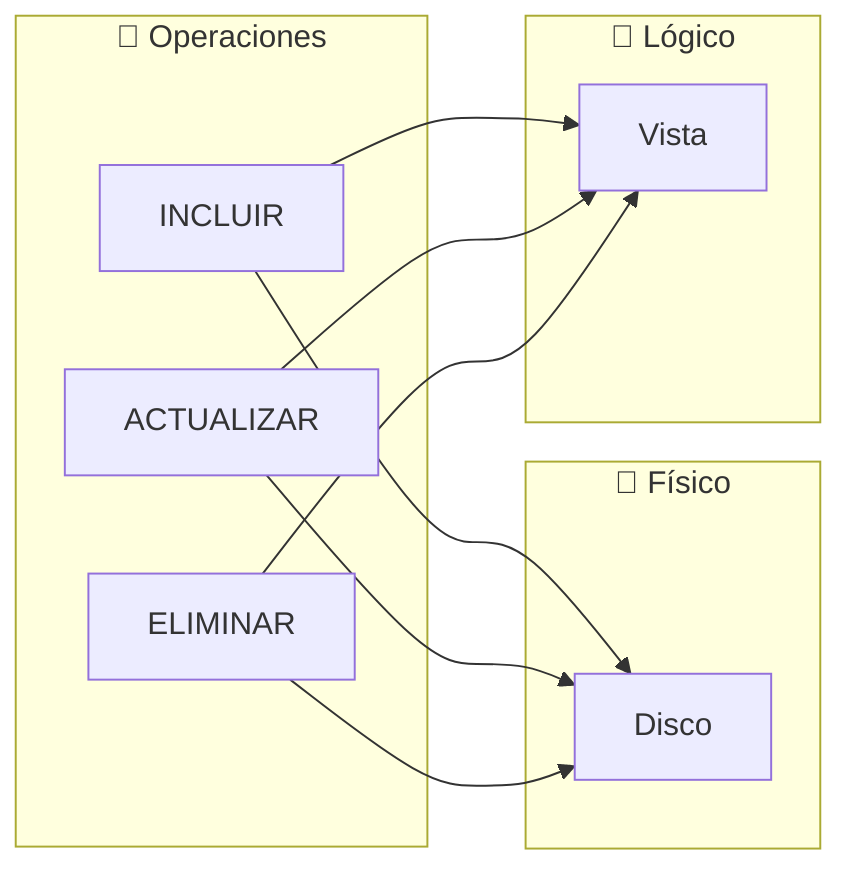

---
layout: section
---

# Parte 3
## Clasificación de Estructuras

---
layout: section-2
---

# Clasificación General
## Maestro, Movimiento, Histórico

---
layout: default
---

# Archivo MAESTRO

<div grid grid-cols-2 gap-8 items-center>

<div>

<v-clicks>

- Contiene **datos permanentes** y estables
- Información **base** del sistema
- Se actualiza con **poca frecuencia**
- Es la **referencia principal**

</v-clicks>

<v-click>

<div mt-4 p-3 bg-emerald-100 dark:bg-emerald-900 rounded op-80>

**Ejemplos:** Catálogo de productos, Lista de empleados, Datos de clientes

</div>

</v-click>

</div>

<v-click>

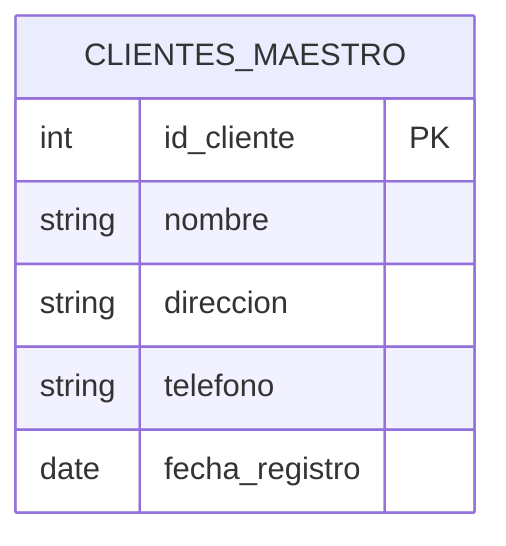

</v-click>

</div>

---
layout: default
---

# Archivo de MOVIMIENTO

<div grid grid-cols-2 gap-8 items-center>

<div>

<v-clicks>

- Registra **transacciones diarias**
- Datos **temporales** y dinámicos
- Se actualiza **constantemente**
- Interactúa con el archivo maestro

</v-clicks>

<v-click>

<div mt-4 p-3 bg-amber-100 dark:bg-amber-900 rounded op-80>

**Ejemplos:** Ventas del día, Entradas/salidas de almacén, Transacciones bancarias

</div>

</v-click>

</div>

<v-click>

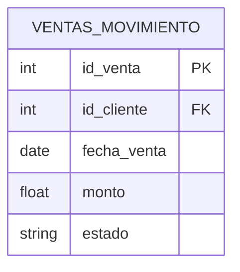

</v-click>

</div>

---
layout: default
---

# Archivo HISTÓRICO

<div grid grid-cols-2 gap-8 items-center>

<div>

<v-clicks>

- Almacena **datos antiguos**
- Registros que ya **no están activos**
- Sirve para **consultas** y **auditorías**
- **Respaldo** a largo plazo

</v-clicks>

<v-click>

<div mt-4 p-3 bg-violet-100 dark:bg-violet-900 rounded op-80>

**Ejemplos:** Ventas de años anteriores, Empleados dados de baja, Clientes inactivos

</div>

</v-click>

</div>

<v-click>

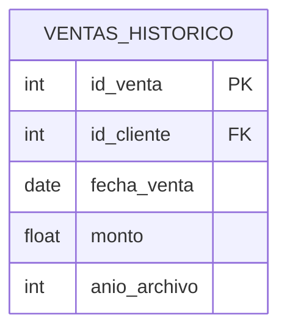

</v-click>

</div>

---
layout: center
---

# Relación entre Archivos

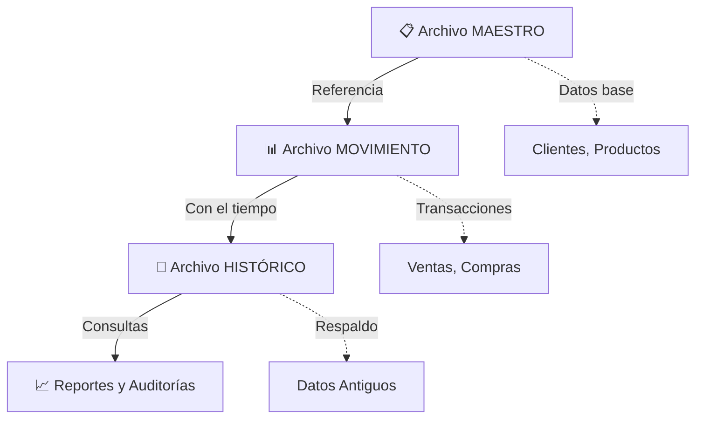

---
layout: section-2
---

# Clasificación por Organización
## Secuencial, Directo, Mixto

---
layout: default
---

# Organización SECUENCIAL

<v-clicks>

- Los registros se almacenan **uno tras otro**
- Acceso en **orden consecutivo**
- Para leer el registro 100, hay que pasar por los 99 anteriores

</v-clicks>

<v-click>

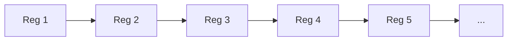

</v-click>

<div grid grid-cols-2 gap-4 mt-4>

<v-click>

<div p-3 bg-emerald-100 dark:bg-emerald-900 rounded op-80 text-sm>

✅ **Ventajas:** Fácil de implementar, eficiente para procesar todos los registros

</div>

</v-click>

<v-click>

<div p-3 bg-red-100 dark:bg-red-900 rounded op-80 text-sm>

❌ **Desventajas:** Lento para buscar registros específicos

</div>

</v-click>

</div>

---
layout: default
---

# Organización DIRECTA (Aleatoria)

<v-clicks>

- Acceso **inmediato** a cualquier registro
- Usa una **función hash** o **dirección directa**
- No necesita recorrer registros previos

</v-clicks>

<v-click>

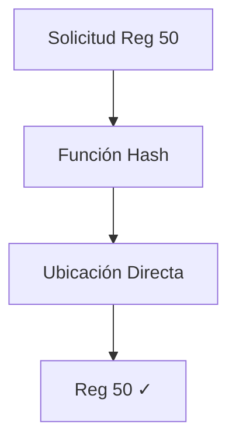

</v-click>

<div grid grid-cols-2 gap-4 mt-4>

<v-click>

<div p-3 bg-emerald-100 dark:bg-emerald-900 rounded op-80 text-sm>

✅ **Ventajas:** Acceso muy rápido a registros específicos

</div>

</v-click>

<v-click>

<div p-3 bg-red-100 dark:bg-red-900 rounded op-80 text-sm>

❌ **Desventajas:** Más complejo, puede desperdiciar espacio

</div>

</v-click>

</div>

---
layout: default
---

# Organización MIXTA (Indexada)

<v-clicks>

- Combina lo mejor de **secuencial + directo**
- Usa **índices** para acceso rápido
- Los datos están ordenados, el índice permite saltar

</v-clicks>

<v-click>

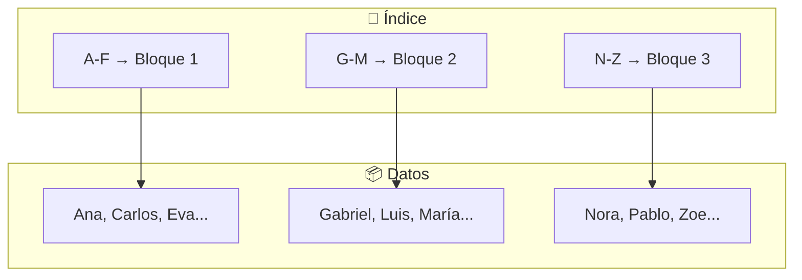

</v-click>

---
layout: default
---

# Comparación de Organizaciones

| Característica | Secuencial | Directo | Mixto |
|:--------------:|:----------:|:-------:|:-----:|
| **Velocidad búsqueda** | 🐢 Lenta | 🚀 Muy rápida | ⚡ Rápida |
| **Complejidad** | Baja | Alta | Media |
| **Uso de espacio** | Eficiente | Variable | Eficiente |
| **Mejor para** | Procesos masivos | Consultas puntuales | Uso general |

---
layout: section-2
---

# Clasificación por Acceso
## Público y Privado

---
layout: default
---

# Acceso PÚBLICO 🌐

<div grid grid-cols-2 gap-8 items-center>

<div>

<v-clicks>

- Datos disponibles para **todos los usuarios**
- **Sin restricciones** de lectura
- Información **no sensible**
- Puede requerir autenticación básica

</v-clicks>

<v-click>

<div mt-4 p-3 bg-gray-100 dark:bg-gray-800 rounded text-sm>

**Ejemplos:** Catálogos, información de contacto, datos públicos de la empresa

</div>

</v-click>

</div>

<v-click>

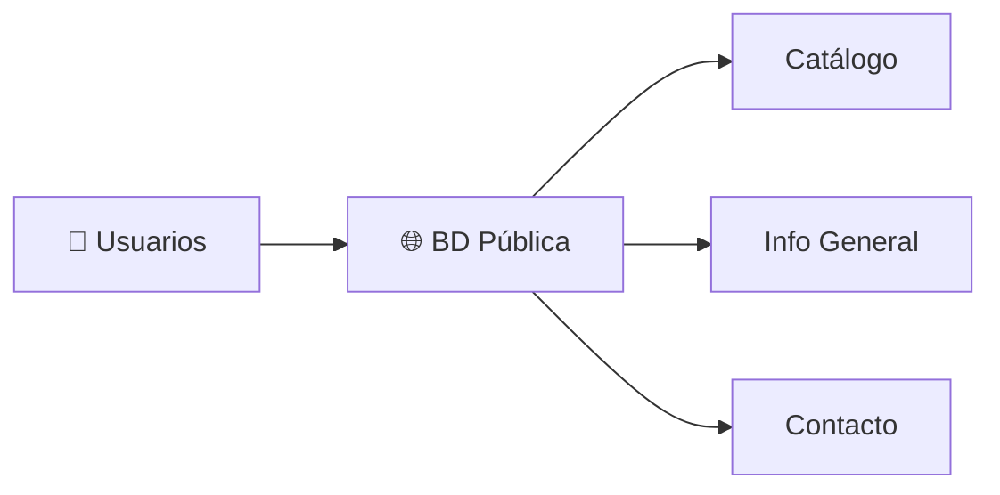

</v-click>

</div>

---
layout: default
---

# Acceso PRIVADO 🔒

<div grid grid-cols-2 gap-8 items-center>

<div>

<v-clicks>

- Datos **restringidos** a usuarios autorizados
- Requiere **autenticación** y **permisos**
- Información **sensible** o confidencial
- Control de **quién puede ver/modificar**

</v-clicks>

<v-click>

<div mt-4 p-3 bg-gray-100 dark:bg-gray-800 rounded text-sm>

**Ejemplos:** Salarios, datos personales, información financiera

</div>

</v-click>

</div>

<v-click>

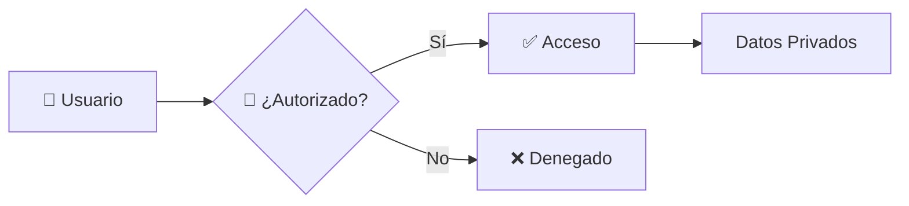

</v-click>

</div>

---
layout: default
---

# Niveles de Acceso

<div flex justify-center>

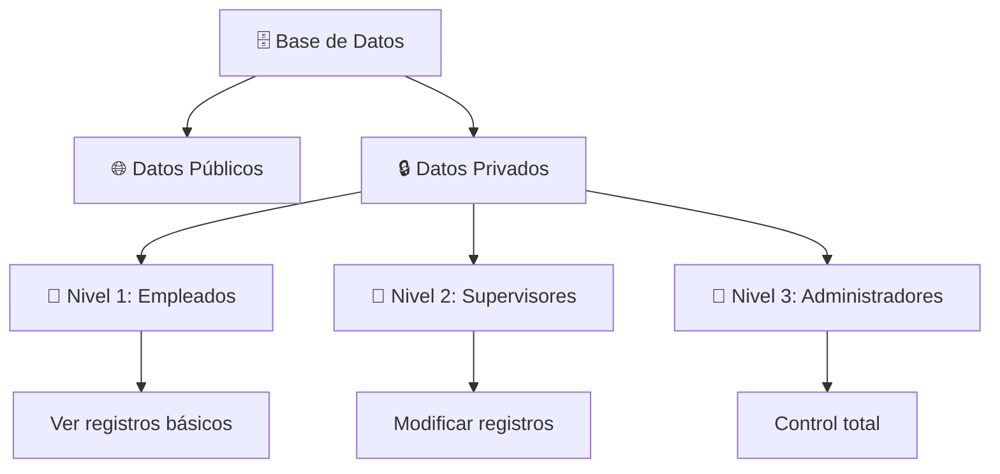

</div>

---
layout: default
---

# Comparación de Accesos

<div grid grid-cols-2 gap-8>

<v-click>

<div bg-gray-100 dark:bg-gray-800 p-6 rounded-lg>

## 🌐 Público

- ✅ Fácil de implementar
- ✅ Acceso rápido
- ⚠️ Sin protección de datos
- 📌 Información general

</div>

</v-click>

<v-click>

<div bg-gray-100 dark:bg-gray-800 p-6 rounded-lg>

## 🔒 Privado

- ✅ Datos protegidos
- ✅ Control de acceso
- ⚠️ Más complejo de gestionar
- 📌 Información sensible

</div>

</v-click>

</div>

---
layout: section-3
---

# Resumen Final

---
layout: default
---

# Mapa Conceptual Completo

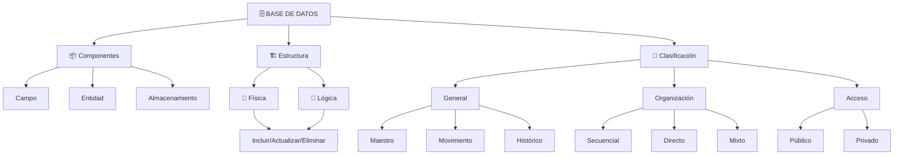

---
layout: quote
---

# ¡Gracias!